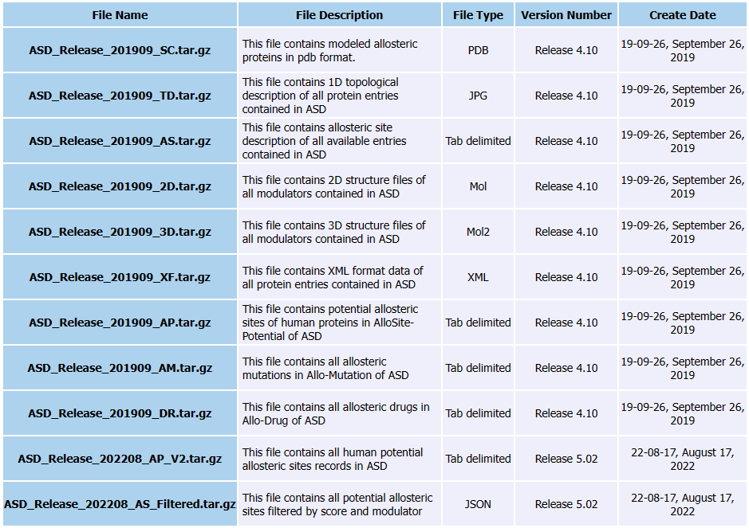
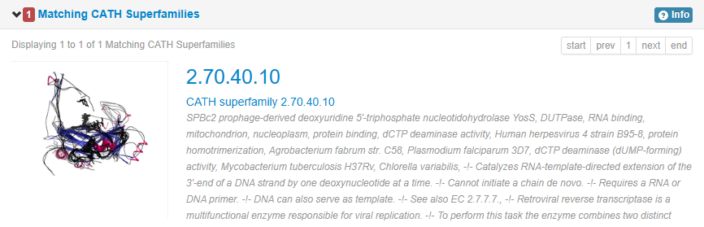
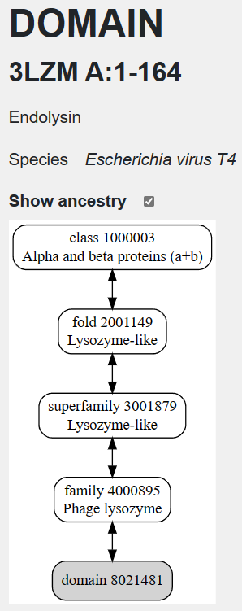

# ASD: a comprehensive database of allosteric proteins and modulators

## 作者

Zhimin Huang, Liang Zhu, Yan Cao, Geng Wu, Xinyi Liu, Yingyi Chen, Qi Wang, Ting Shi, Yaxue Zhao, Yuefei Wang, Weihua Li, Yixue Li, Haifeng Chen, Guoqiang Chen, Jian Zhang

## 刊物

Nucleic Acids Research

## 解决问题

* 专门用于变构的数据库和分析系统对于捕获和描述快速增加的变构分子数量，更好地理解变构蛋白的机制和设计变构调节剂进行药物发现至关重要

## 创新点

* 提出了变构空间数据库（AlloSteric Database，ASD），是第一个在线数据库，为变构分子的显示、搜索和分析结构、功能和相关注释提供了中心资源。
* 包含101种336个变构蛋白和8095个变构调制器modulator（激活剂、抑制剂和调节剂）。详细描述了蛋白质变构allostery，生物过程biological process和相关疾病related disease；以及分子的结合亲和力，物理化学性质和治疗领域。
* 整合ASD中变构蛋白的信息，可以在同一家族的蛋白质中识别特定亚型subtype的特定变构位点allosteric site，这可能是实验验证的理想靶点。
* 在ASD中筛选的调节剂可用于研究查询化合物的有效变构靶点，也可帮助化学家对新型变构药物设计进行结构修改。
* 蛋白质的BLAST搜索引擎和小调制器的化学结构搜索引擎可以作为基于网络的变构识别工具。

## 思路概述

### 变构蛋白获取

* **原始获取**：变构的信息从科学文献和各种网络资源中收集（IUPARM、drugbank、PDB、美国专利和欧洲专利文件）。使用“alloster”为关键词自动筛选16425篇PubMed摘要，获取相关文章。然后通过UniProt构建的蛋白质名称字典从摘要中提取变构蛋白的名称到聚类中，检索出500种不同的生物蛋白。
* **筛选**：从至少三个实验证据（变构残基的非活性突变，两个配体的动力学效应的协同性和与色谱的非竞争结合分析等）中，找到336个变构蛋白。
* **变构蛋白注释**：从GenBank、Uniprot、Enzyme Nomenclature和原始文献中提取的基因信息、生物学功能、自然突变及相关疾病进行了注释。
* 对PDB中变构蛋白进行最新的同步分析，并标记了基于PDB ID的结构分类SCOP和CATH。
* 从变构蛋白的多个构象结构推断出的大规模变构构象变化，如开闭和扭曲，被手工注释到变构模式场。
* 当最佳I-TASSER模型的c分数低于1.5或PDB中有高同源低聚模板时，使用无结构的变构蛋白理论模型或使用Modeller手动构建。

### 变构调节剂获取

* 从PubMed、美国专利和欧洲专利文件中的摘要中，结合收集的变构蛋白名称，根据关键词（allosteric modulator/effector/activator/inhibitor/agonist/antagonist）整理，然后手工确定为最终的集合，结果收集了8095个化学变构调节剂和各自的参考文献。
* 从参考文献中获得了变构调节剂与蛋白质中变构位点的公开结合亲和力。
* **allosteric activator (A)**：变构激活剂，增加特定蛋白质功能的物质。
* **allosteric inhibitor (I)**：变构抑制剂，降低特定蛋白质功能的蛋白。
* **allosteric regulator (R)**：变构调节，控制多聚蛋白的协同性，通过变构位点结合蛋白在变构控制下间接调节酶，诱导蛋白质新的结合位点等。
* **endogenous**：内源性，体内产生的配体。
* **druggable**：药物，为药物使用设计的变构调节剂。

## 数据集

* **下载地址**：<https://mdl.shsmu.edu.cn/ASD/module/download/download.jsp?tabIndex=1>
* **文件结构**：

## 评价指标

## 结论和实验结果

## 存在问题

## 扩展知识

### 变构作用

* 变构作用allostery，描述了配体在与正构位点orthosteric site不同的变构位点allosteric site结合所引起的蛋白质功能、结构、灵活性的调节。
* 变构作用是调节蛋白质功能最直接、最快速、最有效的方式，从控制代谢机制到信号转导途径。
* 变构行为主要是通过金属离子metal ion或分子的特异性结合来发现的，它们可以改变细胞的反应以维持内稳态。金属离子和小分子作为变构调节剂modulator结合到变构位点，包括激活剂activator/激动剂agonist、抑制剂inhibitor/拮抗剂antagonist和其他效应类型
* 变构系统的失调与人类疾病显著相关，如阿尔茨海默病、炎症和糖尿病。
* 蛋白质的变构效应通过原子的波动、氨基酸残基网络或结构域运动之间的距离，将构象变化从变构位点传递到正构位点，最终导致两个或多个构象状态之间的功能转换。由外部因素固定的持久性构象能够在该状态下可持续地发挥作用。

### I-TASSER

* **I-TASSER**是一个根据氨基酸序列预测蛋白质结构和蛋白质功能的软件，是CASP的蛋白质结构预测的首选服务器。给出的预测结果注释非常多，包括二级结构预测结果，溶剂可及表面积，预测的温度因子等。会给出5个分数最高的预测结果。评价指标包括C-score，TM-score，C-score代表置信度，TM-score是反映两个结构相似度的打分。
* 参考博客：<https://blog.sciencenet.cn/home.php?mod=space&uid=1509670&do=blog&id=1194934>
* 网址：<https://zhanggroup.org/I-TASSER/>

### CATH

* **CATH**蛋白质结构分类数据库。CATH为每一层的每一种结构分类命名，并用数字代号代表这一分类。因此每个结构域会具有一个分类代码，例如3H6X就是2.70.40.10。目前CATH 已为PDB 数据库中10 多万个蛋白质结构所涉及的30 多万个结构域进行了结构分类，这些分类可以归入两千七百多个蛋白质超家族中。
* **C**：CATH将所有蛋白质结构域分成4种Class，分别是全$\alpha$型，全$\beta$型， $\alpha+\beta$型，低二级结构型。
* **A**：每一个Class中的结构域又被具体分为不同的Architecture。按照螺旋和折叠所形成的超二级结构排列方式进行分类。比如桶状的，三明治状的，还有滚轴状等Architecture。
* **T**：每种Architecture里的结构域又可以根据二级结构的形状和二级结构间的联系更进一步分为不同的Topology。
* **H**：通过序列比较以及结构比较确定同源性分类，划分出不同的Homologous superfamily。
* 网址：<http://www.cathdb.info/>

### SCOP

* 也属于蛋白质结构分类数据库，但SCOP的分类原则更多考虑蛋白质间的进化关系，而且分类主要依赖于人工验证。结构分类也基于四个层次。
* **Class**：基于二级结构成分分类。
* **Fold**：主要考虑结构的空间几何关系。
* **Superfamily**：基于远源的蛋白质进化关系分类。
* **Family**：基于近源的蛋白质进化关系分类。
* 网址：<https://scop2.mrc-lmb.cam.ac.uk/>

### Modeller

* 用于蛋白质三维结构的同源或比对建模。
* 参考博客：<https://blog.csdn.net/MurphyStar/article/details/108498338>
