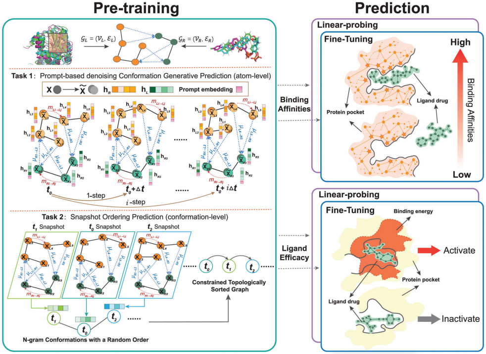

# Pre-Training of Equivariant Graph Matching Networks with Conformation Flexibility for Drug Binding

## 作者

Fang Wu, Shuting Jin, Yinghui Jiang, Xurui Jin, Bowen Tang, Zhangming Niu, Xiangrong Liu, Qiang Zhang, Xiangxiang Zeng, and Stan Z. Li

## 刊物

Advanced Science

## 解决问题

* 容纳小分子的受体的过程已被证明是高度动态和时间依赖的，静止的“lock-and-key”理论并不普遍适用。
* 先前基于深度学习的研究只关注单一、稳定和静态构象，而没有考虑时间依赖的迁移率。
* 基于分子动力学的方法对分子构象进行彻底采样，对着蛋白质轨迹相关数据的增长，成本也惊人增长。计算支出限制了蛋白质轨迹相关研究的增长，从而阻碍了监督学习的可能性。

## 创新点

* 两个专门设计的自监督学习任务：原子级提示去噪生成任务（atom-level prompt-based denoising generative task）和构象级快照排序任务（conformation-level snapshot ordering task）。
* ProtMD可以赋予编码器网络捕获沿分子动力学轨迹的构象的时间依赖性几何迁移率的能力。
* 构象在三维空间中的运动幅度与配体与其受体结合的强度之间有很强的相关性。
* 改进了一个E(3)-等变图匹配网络（Equivariant Graph Matching Network，EGMN）来应对配体结合建模，并将其作为ProtMD的主干。EGMN作为几何网络可以联合转换特征和三维坐标，在图内和图间进行消息传递。

## 思路概述

### 蛋白质配体和受体表示

* 每个蛋白质配体对表示为时间步为T的MD轨迹，每个时间步t上的配体图为$G^{(t)}_L=(V^{(t)}_L,E^{(t)}_L)$，受体图表示为$G^{(t)}_R=(V^{(t)}_R,E^{(t)}_R)$。
* 原子作为节点，使用它们的三位坐标表示，即$\bold{x}^{(t)}_L\in R^{N\times 3}$和$\bold{x}^{(t)}_R\in R^{M\times 3}$。
* 设初始$\Psi_h$维的旋转平移不变特征（例如原子类型、电负性等）为$\bold{h}^{(t)}_L\in R^{N\times \Psi_h}$和$\bold{h}^{(t)}_R\in R^{M\times \Psi_h}$。
* 边包括所有距离小于$4\mathring{A}$。
* 整条时空蛋白序列表示为$\{(G^{(t)}_L,G^{(t)}_R)\}^T_{t=1}$。

### 原子级提示去噪生成任务

* 要求模型根据当前的模型产生未来的构象。
* 设置prompt嵌入$\bold{h}^{\Delta t_i}_{prompt}\in R^{\Psi_{prompt}}$，将prompt加在时间t的原子特征上作为预测$t+1$步构象任务的输入。
* 在每个时间步长用少量的随机噪声来扰动输入的构象$(G^{(t)}_L,G^{(t)}_R)$。（1）在局部能量最小值下，配体和受体的几何形状的随机扭曲是更高的能量构型，去噪过程映射了一个噪声分子从高能量到低能量的过程。（2）一定程度上揭示了结合强度，并准确地保持了我们期望从MD轨迹编码的隐藏信息。（3）由于相邻构象或近步构象之间的差异很小，噪声有助于防止过拟合，使预训练前更鲁棒。

### 构象级快照排序任务

* 要求模型来识别一组连续快照的时间顺序，将一组密切相关的构象排序为一个相干的子轨迹，这就教会了模型从全局的角度来理解它们的依赖性。

### 等变图匹配网络

* 使用E(3)-EGMN作为ProtMD模型的分子编码器网络，严格区分两图内部交互和交叉交互，基于空间相关性表示为$E^{(t)}_L \cup E^{(t)}_R$和$E^{(t)}_{LR}$。避免了由于配体和受体之间的隐式位置关系而导致的交叉图边缘信息（例如，原子间距离）的未充分利用。
* 输入是原子嵌入$\{\bold{h}^{(t)}_L,\bold{h}^{(t)}_R\}$和三维坐标$\{\bold{x}^{(t)}_L,\bold{x}^{(t)}_R\}$，输出是转换后的原子嵌入$\{\bold{h}^{(t+1)}_L,\bold{h}^{(t+1)}_R\}$和三维坐标$\{\bold{x}^{(t+1)}_L,\bold{x}^{(t+1)}_R\}$。

### 模型结构和代码链接

* 代码链接：<https://github.com/smiles724/ProtMD>

## 数据集

* PDBbind中选择了64对蛋白质配体对，经过Amber生成一系列时间间隔的构象。只使用口袋部分作为模型输入。
* 结合亲和力预测：PDBbind数据库，预测负的对数转换亲和力$pK=-log(K)$。

## 评价指标

* 结合亲和力：RMSE、皮尔逊相关系数、斯皮尔曼相关系数
* 配体效能预测（Ligand Efficacy Prediction）：AUROC、AUPRC

## 结论和实验结果

### 实验数值结果

* 结合亲和力：获得了最低的RMSE，而且还获得了最高的皮尔逊和斯皮尔曼相关性。只有64个蛋白质的轨迹中进行了预训练，但在超过3K个蛋白质中进行了检测。ProtMD具有很强的泛化能力。
* 配体效能预测：预测一个结合在这些结构上的分子是否会成为蛋白质功能的激活剂。只使用配体周围半径为$5.5\mathring{A}$内的区域作为模型输入，并采用二元交叉熵损失作为损失函数。ProtMD可以同时实现AUPRC和AUROC的最高值。
* 对未知结构对的泛化能力：实验共晶结构并不总是可获得的。使用Equibind来快速定位PDBbind中所有测试样品的结合位点和配体的结合姿态和取向，并删除配受体距离大于$6\mathring{A}$的配对。可以发现ProtMD的RMSE仍然低至1.474。这表明了ProtMD对未知结构的推广能力。

### 分析

* 空间位置的变化与结合亲和度高度相关。具有良好初始结合模式的配体在MD模拟中倾向于保持稳定。在配体效能预测任务中，平均变化也与蛋白质-配体对的活性有关。ProtMD可以正确地捕捉三维位置和相应的药物绑定相关属性之间的内在联系。
* 50个蛋白质进行轨迹采样效果最佳

## 存在问题

## 扩展知识

### 自监督学习

* 自监督学习先用无标签数据集把参数从一张白纸训练到初步成型，再根据下游任务，利用标签数据将模型从初步成型训练到完全成型。就像BERT一样，先用mask机制学习表示，然后用于下游任务。
* 参考博客：<https://zhuanlan.zhihu.com/p/381354026>
