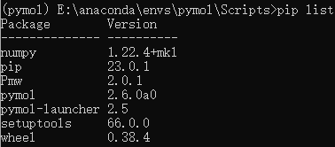

# PyMOL安装教程

* 下载Anaconda，并创建Python 3.11的环境。如果直接在电脑上配置Python环境也可以，不过Anaconda更方便多环境管理。

* 下载安装包，包括numpy+mkl、Pmw、PyMOL和pymol_launcher
  
  numpy+mkl：<https://download.lfd.uci.edu/pythonlibs/archived/numpy-1.22.4+mkl-cp311-cp311-win_amd64.whl>
  
  pmw：<https://download.lfd.uci.edu/pythonlibs/archived/Pmw-2.0.1-py3-none-any.whl>
  
  pymol：<https://download.lfd.uci.edu/pythonlibs/archived/pymol_launcher-2.5-cp311-cp311-win_amd64.whl>
  
  pymol_launcher：<https://download.lfd.uci.edu/pythonlibs/archived/pymol_launcher-2.5-cp311-cp311-win_amd64.whl>

* 将安装包放到创建好的Python环境中，例如E:\anaconda\envs\pymol\Scripts，这里的pymol是我给环境起的名字。
  
* 从Anaconda prompt中安装上述三个文件

  ```
  pip install numpy-1.22.4+mkl-cp311-cp311-win_amd64.whl
  pip install Pmw-2.0.1-py3-none-any.whl
  pip install pymol-2.6.0a0-cp311-cp311-win_amd64.whl
  pip install pymol_launcher-2.5-cp311-cp311-win_amd64.whl
  ```
* 安装PyQt，这样可以更好的显示pymol的界面
  ```
  pip3 install PyQt5
  ```

* 输入pip list检查安装程序

<p align="center"></p>

* 在E:\anaconda\envs\pymol\Scripts中出现PyMOL的exe文件，双击即可进入软件。美中不足的是需要进入Anaconda的子文件夹中才能找到PyMOL，完美主义者可以把PyMOL环境装在PyMOL的文件夹中，然后重复上述过程。